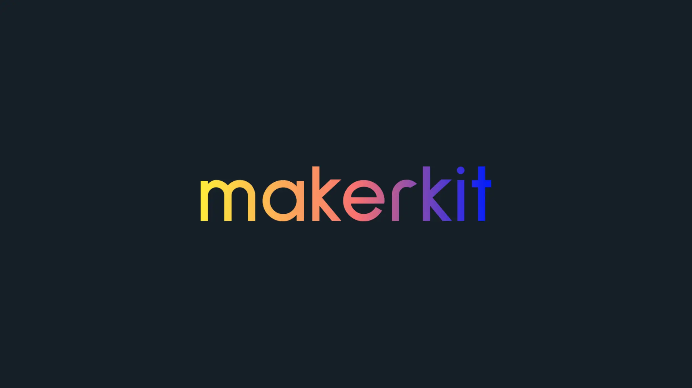

# Uptime by Flinkeo

Uptime is Flinkeo's uptime and monitoring web platform, built with Next.js 15 and Supabase.

👉 **Official Website:** [flinkeo.online](https://flinkeo.online)

⭐️ **Why Teams Trust Uptime:**
- Production-grade architecture decisions
- Comprehensive TypeScript setup
- Modern stack: Next.js 15, Supabase, TailwindCSS v4
- Quality Code tooling: ESLint v9, Prettier, strict TypeScript, etc.
- Regular updates and active maintenance

PS: the documentation for this platform is still being updated, so please check back later for more details.

## What's Included

### Core Architecture
- 🏗️ Next.js 15 + Turborepo monorepo setup
- 🎨 Shadcn UI components with TailwindCSS v4
- 🔐 Supabase authentication & basic DB
- 🌐 i18n translations (client + server)
- ✨ Full TypeScript + ESLint v9 + Prettier configuration

### Key Features
- 👤 User authentication flow
- ⚙️ User profile & settings
- 📱 Responsive marketing pages
- 🔒 Protected routes
- 🎯 Basic test setup with Playwright

### Technologies

This platform is powered by:

🛠️ **Technology Stack**:
- [Next.js 15](https://nextjs.org/): A React-based framework for server-side rendering and static site generation.
- [Tailwind CSS](https://tailwindcss.com/): A utility-first CSS framework for rapidly building custom designs.
- [Supabase](https://supabase.com/): A realtime database for web and mobile applications.
- [i18next](https://www.i18next.com/): A popular internationalization framework for JavaScript.
- [Turborepo](https://turborepo.org/): A monorepo tool for managing multiple packages and applications.
- [Shadcn UI](https://shadcn.com/): A collection of components built using Tailwind CSS.
- [Zod](https://github.com/colinhacks/zod): A TypeScript-first schema validation library.
- [React Query](https://tanstack.com/query/v4): A powerful data fetching and caching library for React.
- [Prettier](https://prettier.io/): An opinionated code formatter for JavaScript, TypeScript, and CSS.
- [Eslint](https://eslint.org/): A powerful linting tool for JavaScript and TypeScript.
- [Playwright](https://playwright.dev/): A framework for end-to-end testing of web applications.

This repository powers the Uptime web application for Flinkeo.

## Platform Highlights

Uptime helps teams:
- Monitor service health and uptime
- Manage user access and account settings
- Use secure authentication and protected routes
- Scale on a modern Next.js + Supabase stack

Core capabilities include:
- 💳 Complete billing and subscription system
- 👥 Team accounts and management
- 📧 Mailers and Email Templates (Nodemailer, Resend, etc.)
- 📊 Analytics (GA, Posthog, Umami, etc.)
- 🔦 Monitoring providers (Sentry, Baselime, etc.)
- 🔐 Production database schema
- ✅ Comprehensive test suite
- 🔔 Realtime Notifications
- 📝 Blogging system
- 💡 Documentation system
- ‍💻 Super Admin panel
- 🕒 Daily updates and improvements
- 🐛 Priority bug fixes
- 🤝 Support
- ⭐️ Used by 1000+ developers
- 💪 Active community members
- 🏢 Powers startups to enterprises

[Learn more](https://flinkeo.online)

## Getting Started

### Prerequisites

- Node.js 18.x or later (preferably the latest LTS version)
- Docker
- PNPM

Please make sure you have a Docker daemon running on your machine. This is required for the Supabase CLI to work.

### Installation

#### 1. Clone this repository

```bash
git clone https://github.com/flinkeo/uptime.git
```

#### 2. Install dependencies

```bash
pnpm install
```

#### 3. Start Supabase

Please make sure you have a Docker daemon running on your machine.

Then run the following command to start Supabase:

```bash
pnpm run supabase:web:start
```

Once the Supabase server is running, please access the Supabase Dashboard using the port in the output of the previous command. Normally, you find it at [http://localhost:54323](http://localhost:54323).

You will also find all the Supabase services printed in the terminal after the command is executed.

##### Stopping Supabase

To stop the Supabase server, run the following command:

```bash
pnpm run supabase:web:stop
```

##### Resetting Supabase

To reset the Supabase server, run the following command:

```bash
pnpm run supabase:web:reset
```

##### More Supabase Commands

For more Supabase commands, see the [Supabase CLI documentation](https://supabase.com/docs/guides/cli).

```
# Create new migration
pnpm --filter web supabase migration new <name>

# Link to Supabase project
pnpm --filter web supabase link

# Push migrations
pnpm --filter web supabase db push
```

#### 4. Start the Next.js application

```bash
pnpm run dev
```

The application will be available at http://localhost:3000.

#### 5. Code Health (linting, formatting, etc.)

To format your code, run the following command:

```bash
pnpm run format:fix
```

To lint your code, run the following command:

```bash
pnpm run lint
```

To validate your TypeScript code, run the following command:

```bash
pnpm run typecheck
```

Turborepo will cache the results of these commands, so you can run them as many times as you want without any performance impact.

## Project Structure

The project is organized into the following folders:

```
apps/
├── web/                  # Next.js application
│   ├── app/             # App Router pages
│   │   ├── (marketing)/ # Public marketing pages
│   │   ├── auth/        # Authentication pages
│   │   └── home/        # Protected app pages
│   ├── supabase/        # Database & migrations
│   └── config/          # App configuration
│
packages/
├── ui/                  # Shared UI components
└── features/           # Core feature packages
    ├── auth/           # Authentication logic
    └── ...
```

For more information about this project structure, see the article [Next.js App Router: Project Structure](https://flinkeo.online/blog/tutorials/nextjs-app-router-project-structure).

### Environment Variables

You can configure the application by setting environment variables in the `.env.local` file.

Here are the available variables:

| Variable Name | Description | Default Value |
| --- | --- | --- |
| `NEXT_PUBLIC_SITE_URL` | The URL of your web application | `http://localhost:3000` |
| `NEXT_PUBLIC_PRODUCT_NAME` | The name of your product | `Uptime` |
| `NEXT_PUBLIC_SITE_TITLE` | The website title | `Uptime by Flinkeo` |
| `NEXT_PUBLIC_SITE_DESCRIPTION` | The website meta description | `Uptime is Flinkeo's web platform for uptime monitoring and service visibility.` |
| `NEXT_PUBLIC_DEFAULT_THEME_MODE` | The default theme mode | `light` |
| `NEXT_PUBLIC_THEME_COLOR` | The default theme color | `#ffffff` |
| `NEXT_PUBLIC_THEME_COLOR_DARK` | The default dark-mode theme color | `#0a0a0a` |
| `NEXT_PUBLIC_SUPABASE_URL` | The URL of your Supabase project | `http://127.0.0.1:54321` |
| `NEXT_PUBLIC_SUPABASE_ANON_KEY` | The anon key of your Supabase project | ''
| `SUPABASE_SERVICE_ROLE_KEY` | The service role key of your Supabase project | ''

## Architecture

This project uses a monorepo architecture.

1. The `apps/web` directory is the Next.js application.
2. The `packages` directory contains all the packages used by the application.
3. The `packages/features` directory contains all the features of the application.
4. The `packages/ui` directory contains all the UI components.

For more information about the architecture, please refer to the [Uptime blog post about Next.js Project Structure](https://flinkeo.online/blog/tutorials/nextjs-app-router-project-structure).

### Marketing Pages

Marketing pages are located in the `apps/web/app/(marketing)` directory. These pages are used to showcase platform features and provide information about Uptime.

### Authentication

Authenticated is backed by Supabase. The `apps/web/app/auth` directory contains the authentication pages, however, the logic is into its own package `@kit/auth` located in `packages/features/auth`.

This package can be used across multiple applications.

### Gated Pages

Gated pages are located in the `apps/web/app/home` directory. Here is where you can build authenticated pages for Uptime users.

### Database

The Supabase database is located in the `apps/web/supabase` directory. In this directory you will find the database schema, migrations, and seed data.

#### Creating a new migration
To create a new migration, run the following command:

```bash
pnpm --filter web supabase migration new --name <migration-name>
```

This command will create a new migration file in the `apps/web/supabase/migrations` directory. 

#### Applying a migration

Once you have created a migration, you can apply it to the database by running the following command:

```bash
pnpm run supabase:web:reset
```

This command will apply the migration to the database and update the schema. It will also reset the database using the provided seed data.

#### Linking the Supabase database

Linking the local Supabase database to the Supabase project is done by running the following command:

```bash
pnpm --filter web supabase db link
```

This command will link the local Supabase database to the Supabase project.

#### Pushing the migration to the Supabase project

After you have made changes to the migration, you can push the migration to the Supabase project by running the following command:

```bash
pnpm --filter web supabase db push
```

This command will push the migration to the Supabase project. You can now apply the migration to the Supabase database.

## Going to Production

#### 1. Create a Supabase project

To deploy your application to production, you will need to create a Supabase project.

#### 2. Push the migration to the Supabase project

After you have made changes to the migration, you can push the migration to the Supabase project by running the following command:

```bash
pnpm --filter web supabase db push
```

This command will push the migration to the Supabase project.

#### 3. Set the Supabase Callback URL

When working with a remote Supabase project, you will need to set the Supabase Callback URL.

Please set the callback URL in the Supabase project settings to the following URL:

`<url>/auth/callback`

Where `<url>` is the URL of your application.

#### 4. Deploy to Vercel or any other hosting provider

You can deploy your application to any hosting provider that supports Next.js.

#### 5. Deploy to Cloudflare

The configuration should work as is, but you need to set the runtime to `edge` in the root layout file (`apps/web/app/layout.tsx`).

```tsx
export const runtime = 'edge';
```

Remember to enable Node.js compatibility in the Cloudflare dashboard.

## Deployment Options

[](https://railway.com/deploy/9r-iFh?referralCode=RmCO-Z&utm_medium=integration&utm_source=template&utm_campaign=generic)

## Contributing

Contributions for bug fixed are welcome! However, please open an issue first to discuss your ideas before making a pull request.

## License

This project is licensed under the MIT License. See the [LICENSE](LICENSE) file for more details.

## Support

No dedicated support SLA is provided for this repository. Feel free to open an issue if you have questions or need help.

For product information and updates, visit [flinkeo.online](https://flinkeo.online).
